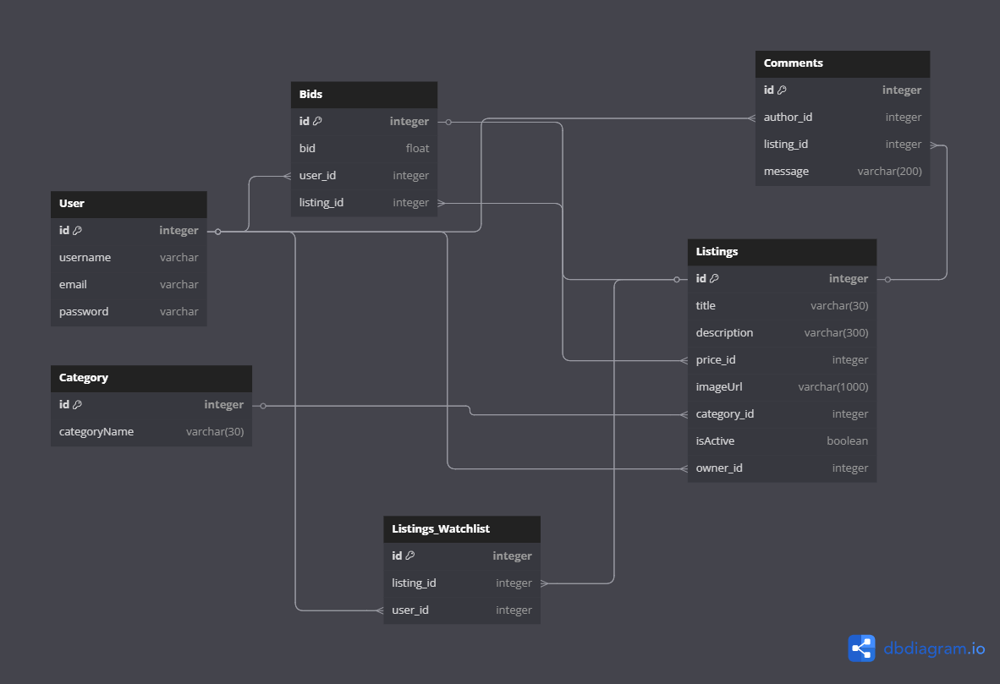

# 🛒 E-commerce Site

A full-featured online auction platform built using **Django** and **Bootstrap**, allowing users to create listings, place bids, comment on products, manage watchlists, and browse by category — all backed by Django's built-in authentication.

## 🔧 Tech Stack

- **Backend**: Django (Python)
- **Database**: SQLite3
- **Frontend**: Bootstrap 4  
- **Auth**: Django’s built-in `AbstractUser` model

---

## 📸 Demo Video https://youtu.be/mZBzNcrIWwc

[](https://www.youtube.com/watch?v=mZBzNcrIWwc)

--- 

## 🧩 Features

### ✅ Authentication
- User Registration & Login (using Django auth)
- Secure session handling

### 📦 Listings
- Create auctions with title, description, starting bid, optional category & image
- Close listings and mark highest bidder as winner

### 💰 Bidding System
- Dynamic price updates as users place higher bids
- Validation to prevent lower or equal bids

### ⭐ Watchlist
- Add or remove listings from personalized watchlist
- View watchlisted items on a dedicated page

### 💬 Comments
- Authenticated users can leave comments on listings
- All comments are listed under each product

### 🗂️ Categories
- Assign categories to listings
- Browse listings category-wise

### 🛠️ Django Admin
- Admin interface for CRUD on users, listings, bids, and comments

---

## 🗂️ Model Schema

Here’s a visual schema of the database models:



- **User**: Inherits from Django `AbstractUser`
- **Listings**: FK to owner (User), FK to Category, FK to price (Bid), M2M with Watchlist (User)
- **Bids**: FK to User, FK to Listings
- **Comments**: FK to User (author), FK to Listings
- **Category**: Name field only

---

## 🚀 Getting Started

1. **Clone the Repository**
   ```bash
   git clone https://github.com/yourusername/ecommerce-site.git
   cd ecommerce-site
   ```

2. **Install Dependencies**
    ```bash
    pip install -r requirements.txt
    ```

3. **Run Migrations**
    ```bash
    python manage.py migrate
    ```

4. **Start the Server**
    ```bash
    python manage.py runserver
    ```

5. Visit http://127.0.0.1:8000/ to explore the app

---

## 📚 What I Learned

- Mastered Django models, views, and template rendering
- Implemented form handling with ModelForms and custom validation logic
- Utilized Django ORM for relational data modeling
- Practiced clean UI/UX using Bootstrap 4 without relying on JavaScript
- Built secure, scalable authentication systems using Django auth
- Leveraged Django’s admin panel for quick backend management
- Enhanced understanding of model relationships (FKs, M2Ms, reverse lookups)


---
### 🙋‍♂️ Author
Shlok Mehndiratta<br>
BS in EECS, IISER Bhopal<br>
[GitHub](https://github.com/shlok-mehndiratta) • [LinkedIn](https://www.linkedin.com/in/shlok-mehndiratta)